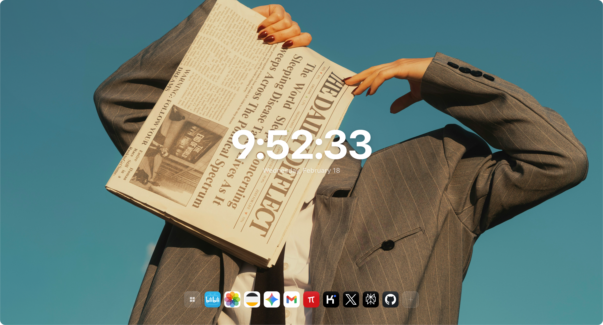
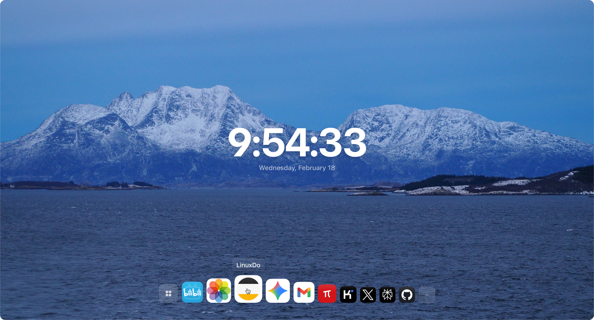
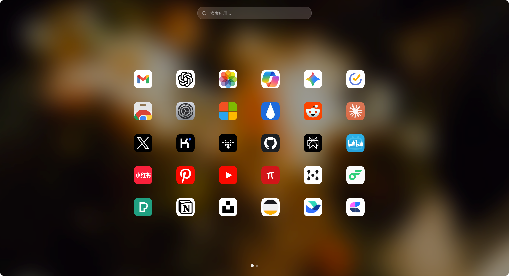
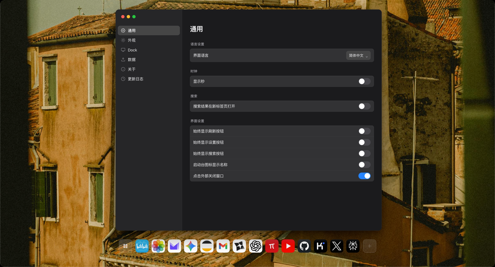
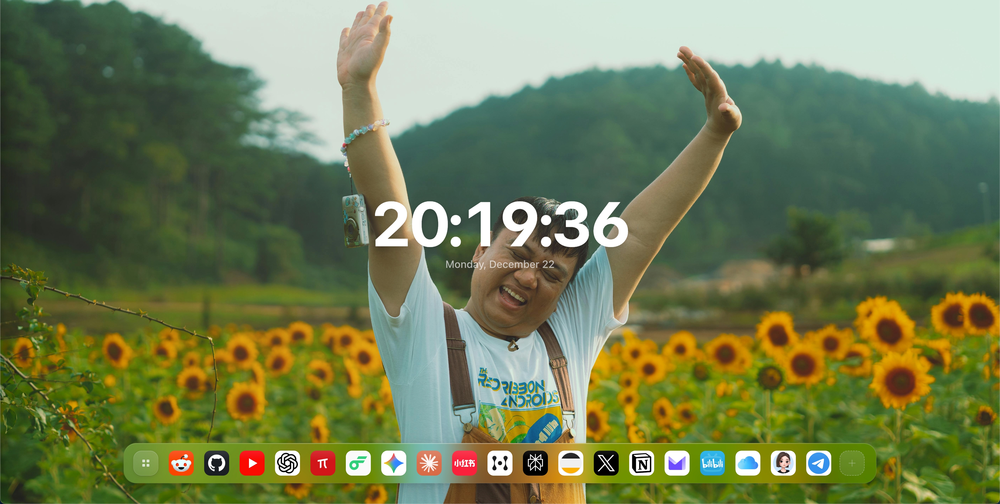

# Aura Tab

[](https://github.com/nil-byte/aura-tab/actions)
[](https://opensource.org/licenses/MIT)
[](https://github.com/nil-byte/aura-tab/releases)
[](https://chromewebstore.google.com/detail/adeamimoopnlcflnpjgcfmebboajlkja)

A beautiful, customizable New Tab page for Chrome/Edge browsers with smart backgrounds and quick links management.

[English](#features) | [中文](#功能特性)

---

## Features

- 🎨 **Smart Backgrounds**: Auto-crop based on screen size with focal point detection, smart aspect ratio adaptation
- 🖼️ **Multiple Sources**: Support for local files, Unsplash, Pixabay, and Pexels with configurable rotation
- 🔗 **Quick Links Manager**: Folder support, drag-and-drop sorting, instant search, pagination, and pin to dock
- 📑 **Bookmark Import**: One-click import from Chrome bookmarks with automatic deduplication
- 🎬 **Smooth Transitions**: Beautiful fade animations when switching backgrounds with configurable interval
- 🌐 **i18n Support**: Full Chinese (Simplified/Traditional) and English localization
- ⚡ **Performance First**: First Paint optimization, background caching with TTL, lazy loading
- 📱 **Responsive Design**: Adapts to different screen sizes, densities, and orientations
- 🔒 **Privacy Focused**: No data collection
- ⚙️ **Flexible Settings**: Background blur effects, clock styles, search engine customization
- 📦 **Launchpad Mode**: macOS-style application launcher with folder organization
- 🔄 **Auto-refresh**: Configurable background refresh with warmup cache strategy

## Screenshots

### Desktop Experience



### Dock & Quick Links



### Launchpad Mode



### Settings Window



### More Features



## Installation

### Chrome Web Store (Recommended)

[](https://chromewebstore.google.com/detail/adeamimoopnlcflnpjgcfmebboajlkja)

Or install directly from [Chrome Web Store](https://chromewebstore.google.com/detail/adeamimoopnlcflnpjgcfmebboajlkja)

### Manual Installation (Developer Mode)

1. Download the latest release from [Releases](https://github.com/nil-byte/aura-tab/releases)
2. Unzip the file
3. Open Chrome/Edge and navigate to `chrome://extensions` or `edge://extensions`
4. Enable "Developer mode" in the top right
5. Click "Load unpacked" and select the unzipped folder
6. Open a new tab to see Aura Tab in action!

## Development

### Prerequisites

- Node.js 20.19+
- npm or pnpm

### Setup

```bash
# Clone the repository
git clone https://github.com/nil-byte/aura-tab.git
cd aura-tab

# Install dependencies
npm install

# Run tests
npm test

# Run tests with coverage
npm run test:coverage

# Run tests in watch mode
npm run test:watch
```

### Project Structure

```
Aura-Tab/
├── scripts/
│   ├── boot/           # First paint optimization
│   ├── domains/        # Feature modules (DDD architecture)
│   │   ├── backgrounds/    # Background system
│   │   ├── quicklinks/     # Quick links & launchpad
│   │   ├── settings/       # Settings window
│   │   ├── bookmarks/      # Bookmark import/export
│   ├── platform/       # Platform abstractions
│   └── shared/         # Shared utilities
├── tests/              # Test files (Vitest)
├── styles/             # CSS styles
├── assets/             # Icons, backgrounds
└── _locales/           # i18n translations
```

### Architecture

This project follows **Domain-Driven Design (DDD)** principles:

- **Domain Layer**: Business logic organized by feature domains
- **Platform Layer**: Abstracted storage, lifecycle, and messaging
- **Shared Layer**: Common utilities and helpers

## Contributing

We welcome contributions! Please see [CONTRIBUTING.md](CONTRIBUTING.md) for guidelines.

### Quick Start for Contributors

1. Fork the repository
2. Create your feature branch: `git checkout -b feature/amazing-feature`
3. Commit your changes: `git commit -m 'feat: add amazing feature'`
4. Push to the branch: `git push origin feature/amazing-feature`
5. Open a Pull Request

### Commit Convention

We follow [Conventional Commits](https://www.conventionalcommits.org/):

- `feat:` New feature
- `fix:` Bug fix
- `docs:` Documentation changes
- `test:` Adding or updating tests
- `refactor:` Code refactoring
- `perf:` Performance improvements
- `chore:` Build process or auxiliary tool changes

## Changelog

### Latest (v3.4)

- Background System: Multi-source support, smart cropping, smooth transitions
- Quick Links: Folder support, drag-and-drop, search, bookmark import
- i18n: Full Chinese and English localization
- Toolbar Customization: Custom icon support

## License

This project is licensed under the MIT License - see [LICENSE](LICENSE) for details.

## Acknowledgments

This project uses the following open-source libraries:

- [Interact.js](https://interactjs.io) - Drag and drop, resizing and multi-touch gestures
- [SortableJS](https://sortablejs.github.io/Sortable) - Reorderable drag-and-drop lists

Background image sources:

- [Unsplash](https://unsplash.com) - Beautiful free photos
- [Pixabay](https://pixabay.com) - Free images and videos
- [Pexels](https://pexels.com) - Free stock photos

---

## 功能特性

- 🎨 **智能背景系统**：根据屏幕尺寸自动裁剪、焦点检测、智能宽高比适配
- 🖼️ **多源支持**：本地文件、Unsplash、Pixabay、Pexels，可配置轮播
- 🔗 **快速链接管理器**：文件夹支持、拖拽排序、即时搜索、分页、固定到 Dock
- 📑 **书签导入**：一键从 Chrome 书签导入，自动去重
- 🎬 **平滑过渡动画**：切换背景时淡入淡出，可配置切换间隔
- 🌐 **国际化**：完整的中英文（简/繁）支持
- ⚡ **性能优先**：首屏优化、背景缓存、TTL 管理、懒加载
- 🎭 **工具栏图标定制**：上传并应用自定义图标，实时预览
- 📱 **响应式设计**：适配不同屏幕尺寸、密度和方向
- 🔒 **隐私保护**：不收集任何数据
- ⚙️ **灵活设置**：背景模糊效果、时钟样式、搜索引擎自定义
- 📦 **启动台模式**：macOS 风格的应用启动器，支持文件夹组织
- 🔄 **自动刷新**：可配置的背景刷新，预热缓存策略

## 安装

### Chrome Web Store（推荐）

[](https://chromewebstore.google.com/detail/adeamimoopnlcflnpjgcfmebboajlkja)

或直接访问 [Chrome Web Store](https://chromewebstore.google.com/detail/adeamimoopnlcflnpjgcfmebboajlkja) 安装

### 手动安装（开发者模式）

1. 从 [Releases](https://github.com/nil-byte/aura-tab/releases) 下载最新版本
2. 解压文件
3. 打开 Chrome/Edge，访问 `chrome://extensions` 或 `edge://extensions`
4. 开启右上角"开发者模式"
5. 点击"加载已解压的扩展程序"，选择解压后的文件夹
6. 打开新标签页即可使用

## 感谢

如果这个项目对你有帮助，请给个 ⭐ Star！

欢迎通过以下方式支持项目：
- 在 [Chrome Web Store](https://chromewebstore.google.com/detail/adeamimoopnlcflnpjgcfmebboajlkja) 留下评价
- 向朋友推荐
- 提交 Issue 或 Pull Request
